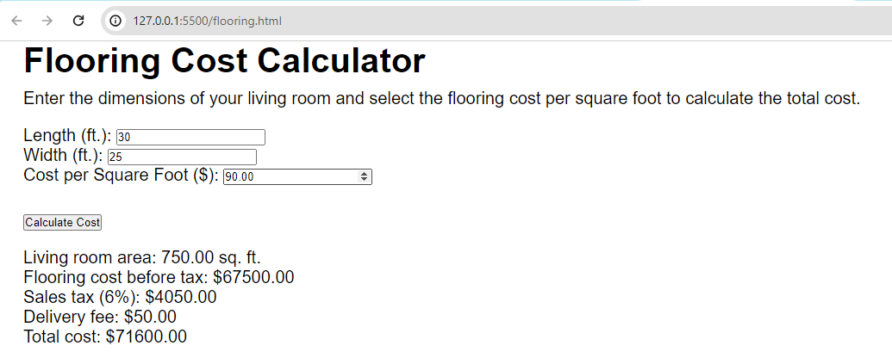

# Project Title

## Submitting Your Work
 - Save your project files to a new GitHub repo named: ***flooring-calculator-js***
 - Copy the web address (URL) that points to your repo and submit it on Google Classroom

## Sample Output

Your finished project should look similar to this example:

*Flooring Cost Calculator output*

## Specifications

Build a web page that meets the following specifications:

 - Displays project name as an h1
 - Includes directions for the user
 - Uses three (3) input elements (see screenshot)
 - Uses a button element
 - Displays the output in an HTML paragraph

## Helpful Resources

 - About [querySelector ( ) method](https://www.w3schools.com/jsref/tryit.asp?filename=tryjsref_document_queryselector_class)
 - [JS template strings](https://www.w3schools.com/js/js_string_templates.asp)
 - [JS toFixed ( ) method](https://www.w3schools.com/jsref/jsref_tofixed.asp)
 - [JS innerHTML property](https://www.w3schools.com/jsref/prop_html_innerhtml.asp)
 

